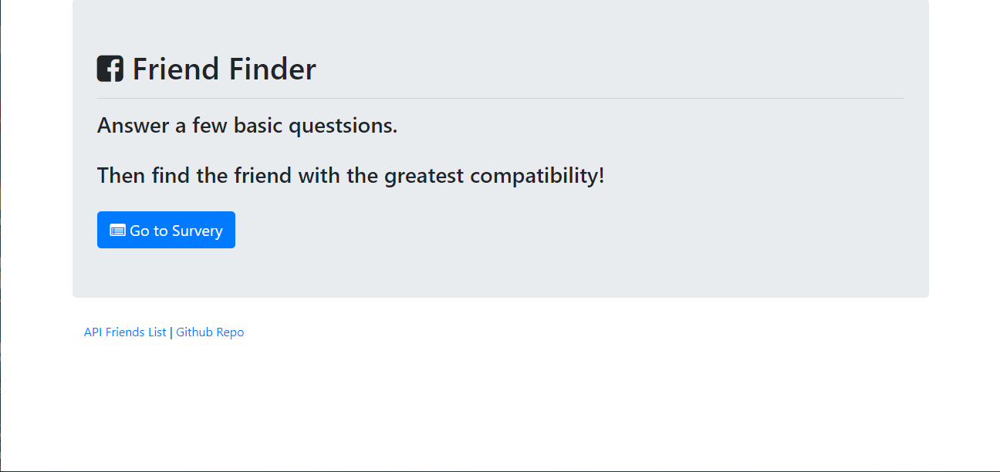
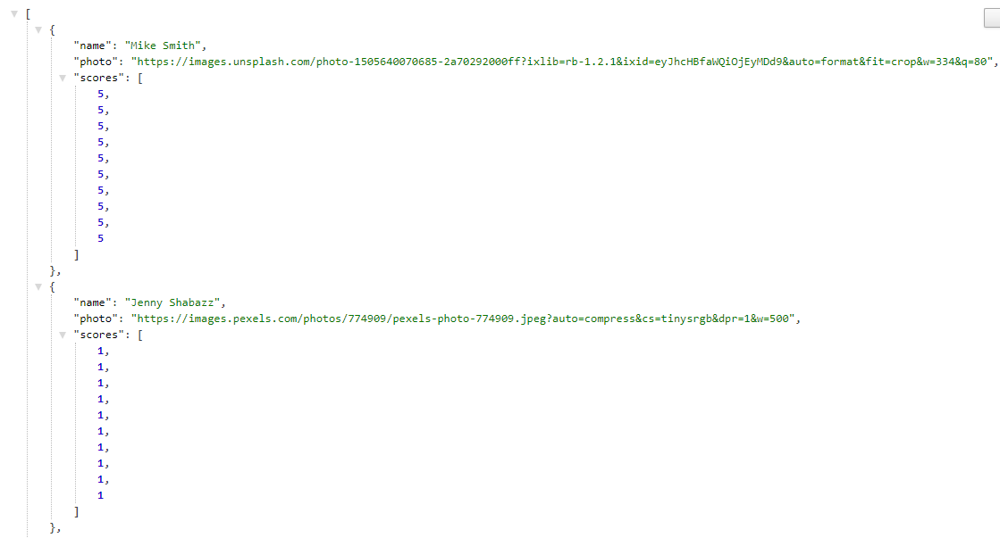
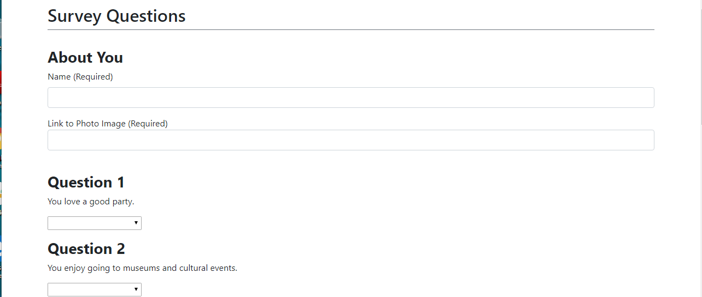
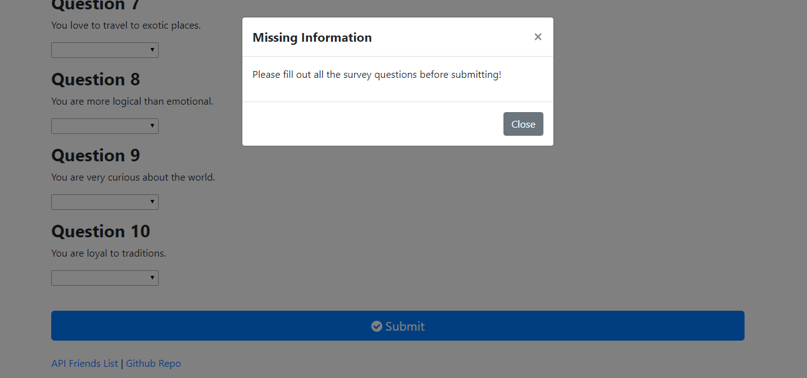
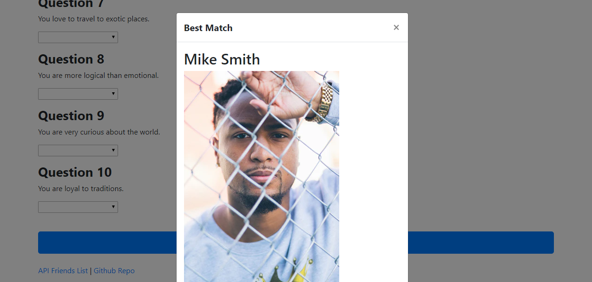

# Friend-Finder (Express and Node Application)

### Overview
This application uses Node and Express to create a website that works similar to current dating websites.  The website has a survey form that the that user must fill out with their name, a link to an image of themselves, and then survey questions for them to answer.  Once the user completes the form and submits their , the website takes that information and sends to a server we created with express.  The server then compares the users survey answers to other previous users answers, and calculates which previous user had the most similar survey answers to the current user.  The server is basically calcuting the *Best Match* for the current user to previous users.  The server then responds back to the webpage with all the information about the previous user it calculated was the *Best Match*.  The website then displays the name and picture of the *Best Match* previous user to the current users screen.

### How the application is organized
* The folder structure for the website is detailed below:
  ```FriendFinder
  - .gitignore
  - app
    - data
      - friends.js
    - public
      - home.html
      - survey.html
    - routing
      - apiRoutes.js
      - htmlRoutes.js
  - node_modules
  - package.json
  - server.js```

This application uses a server.js javascript files that creates a server using express.  The friends.js file holds an array of friends objects which is acting as storage for user information.  The public folder holds the html documents for the website.  Finally the routing folder holds 2 more javascript files.  The htmlRoutes file that handles the movement around the website between html pages.  The apiRoutes handles all the logic for the website to function along with the API call made from the website. 


### Technologies used in the application
1.  Javascript
2.  Node.js
3.  Express NPM
4.  HTML

### Using the application
To use the application please go the deployed website below at Heroku.

  [Heroku Link](https://blooming-scrubland-03101.herokuapp.com/)

When you first git on the website it will take you to the home page.  Screenshot is shown below.


  

It has 2 links at the bottom of the page.  The Github Repo link will send you Github respository for the code.  The API Friends List link will out the array of friends and users that have used the website in a JSON format as noted below.

  

The user can then click on the Go to Survey link which will send them to the survey page to fill out a form about themselves with a list of server questions.

  

All of the text boxes and questions need to be completed otherwise when the user hits submits nothing is submitted and user to notified to complete the form first.

  


Once the user completes all the information in the form, then the website will submit the information to the server which determines the *Best Match* for the current user from previous users and returns back the information on the *Best Match* which the website will then use to display the name and image of the match as seen below.

  

### Links associated with the application
1.  Link to git hub repository for this app:  [Github Link](https://github.com/eozuna3/Friend-Finder)
2.  Link to deployed heroku website:  [Heroku Link](https://blooming-scrubland-03101.herokuapp.com/)